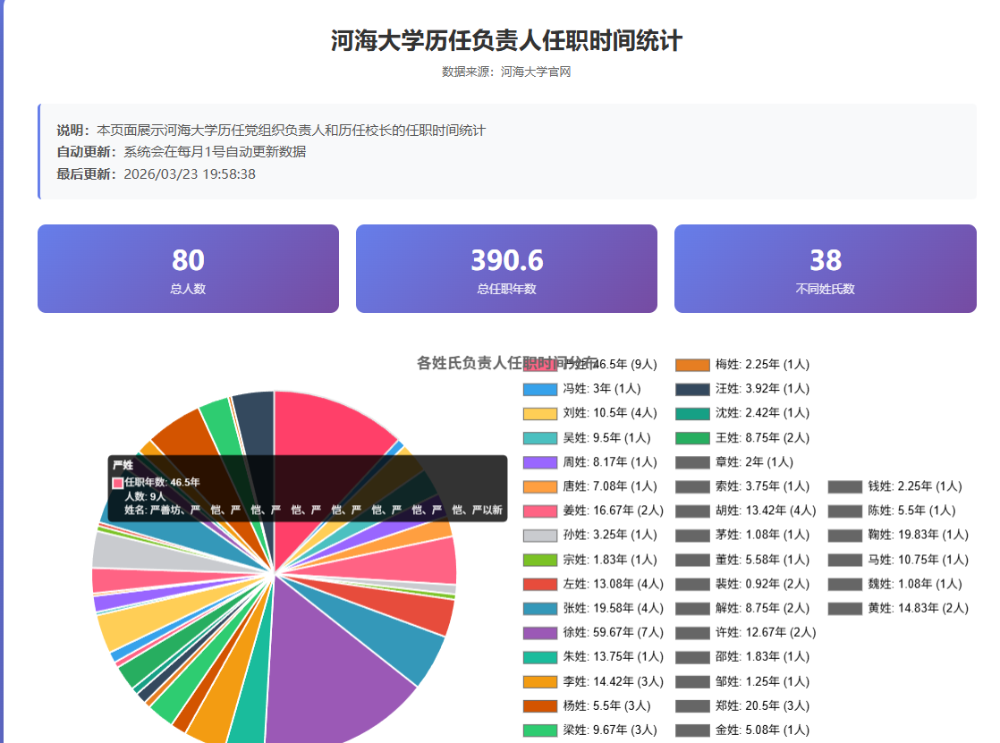

# 河海大学历任负责人任职时间统计

一个用于展示河海大学历任党组织负责人和校长任职时间统计的前端可视化应用。

## 项目简介

本项目从河海大学官网获取历任负责人信息，通过数据分析和可视化展示，帮助用户了解河海大学历任领导班子的任职情况。应用包含饼状图展示、详细数据表格和自动更新功能。

## 功能特性

### 1. 数据展示
- 从河海大学官网数据中提取所有历任党组织负责人和校长的信息
- 包含姓名、职务、任职时间和计算出的任职时长
- 支持从1915年河海工程专门学校建校至今的所有负责人数据

### 2. 任职时间计算
- 自动计算每个人的任职时长（年月格式）
- 智能解析各种时间格式（如：1952.12～1955.03）
- 计算结果精确到月份
- 示例：1952.12～1955.03 计算为 2年3个月

### 3. 饼状图可视化
- 使用 Chart.js 绘制各姓氏负责人任职时间分布的饼状图
- 交互式图表，支持鼠标悬停查看详细信息
- 图例显示每个姓氏的任职年数和人数
- 鼠标悬停显示：
  - 该姓氏的总任职年数
  - 该姓氏的人数
  - 具体姓名列表

### 4. 统计数据
- 总人数：显示所有负责人总数
- 总任职年数：所有负责人的累计任职时间
- 不同姓氏数：统计有多少个不同的姓氏

### 5. 自动更新功能
- 每月1号自动更新数据
- 使用 localStorage 记录最后更新时间
- 显示最后更新时间和下次自动更新时间
- 每分钟检查一次是否需要更新

### 6. 界面特点
- 现代化的渐变背景设计
- 响应式布局，适配不同屏幕尺寸
- 交互式图表和数据表格
- 清晰的信息提示和状态显示
- 优雅的加载和错误处理

## 项目截图



## 技术栈

- **HTML5**: 页面结构
- **CSS3**: 样式设计和响应式布局
- **JavaScript (ES6+)**: 业务逻辑和数据处理
- **Chart.js 4.4.1**: 图表可视化库
- **localStorage**: 本地数据存储

## 文件结构

```
新建文件夹/
├── index.html          # 主应用文件（包含HTML、CSS、JavaScript）
├── README.md           # 项目说明文档
└── 界面截图.png        # 应用界面截图
```

## 使用方法

### 快速开始

1. 直接在浏览器中打开 `index.html` 文件
2. 页面会自动加载数据并显示统计信息
3. 可以通过饼状图和数据表格查看详细信息

### 在本地服务器运行

如果需要在本地服务器上运行：

```bash
# 使用 Python 启动简单HTTP服务器
python -m http.server 8000

# 或使用 Node.js 的 http-server
npx http-server -p 8000
```

然后在浏览器中访问 `http://localhost:8000`

## 数据说明

### 数据来源
- 数据来源于河海大学官网：https://www.hhu.edu.cn/23414/list.htm
- 包含河海大学历任党政负责人信息

### 数据范围
- 时间跨度：1915年至今
- 包含学校各个历史时期的负责人：
  - 河海工程专门学校时期
  - 河海工科大学时期
  - 华东水利学院时期
  - 河海大学时期

### 数据字段
- **姓名**: 负责人姓名
- **职务**: 担任的职务
- **任职时间**: 原始任职时间字符串
- **任职时长**: 计算出的任职时长（年月格式）

## 核心功能实现

### 时间解析
```javascript
function parseTime(timeStr) {
    // 解析时间字符串，如 "1952.12～1955.03"
    // 返回开始和结束日期对象
}
```

### 任职时长计算
```javascript
function calculateDuration(timeData) {
    // 计算任职时长，精确到月份
    // 返回年数、月数和格式化字符串
}
```

### 姓氏统计
```javascript
function getSurname(name) {
    // 提取姓名的第一个字符作为姓氏
    // 统计各姓氏的任职时间分布
}
```

### 自动更新机制
```javascript
// 每月1号自动检查并更新数据
// 使用 localStorage 记录更新状态
setInterval(() => {
    const now = new Date();
    if (now.getDate() === 1 && now.getHours() === 0 && now.getMinutes() === 0) {
        init();
    }
}, 60000);
```

## 浏览器兼容性

- Chrome 90+
- Firefox 88+
- Safari 14+
- Edge 90+

## 性能优化

- 使用 CDN 加载 Chart.js 库
- 数据预处理减少重复计算
- 图表实例复用，避免内存泄漏
- 响应式设计优化移动端体验

## 未来改进

- [ ] 添加数据导出功能（Excel、CSV）
- [ ] 支持按时间段筛选数据
- [ ] 添加更多图表类型（柱状图、折线图）
- [ ] 实现真正的实时数据获取（需要后端支持）
- [ ] 添加搜索和排序功能
- [ ] 支持多语言切换

## 注意事项

1. **数据更新**: 目前数据为静态数据，如需实时更新需要后端API支持
2. **跨域限制**: 直接从网页获取数据可能遇到跨域问题，建议使用代理服务器
3. **浏览器缓存**: 首次加载可能较慢，后续会利用浏览器缓存

## 许可证

本项目仅供学习和研究使用。

## 联系方式

如有问题或建议，欢迎反馈。

## 致谢

- 数据来源：河海大学官网
- 图表库：Chart.js
- 设计灵感：现代数据可视化设计趋势

---

**最后更新**: 2026年3月23日
